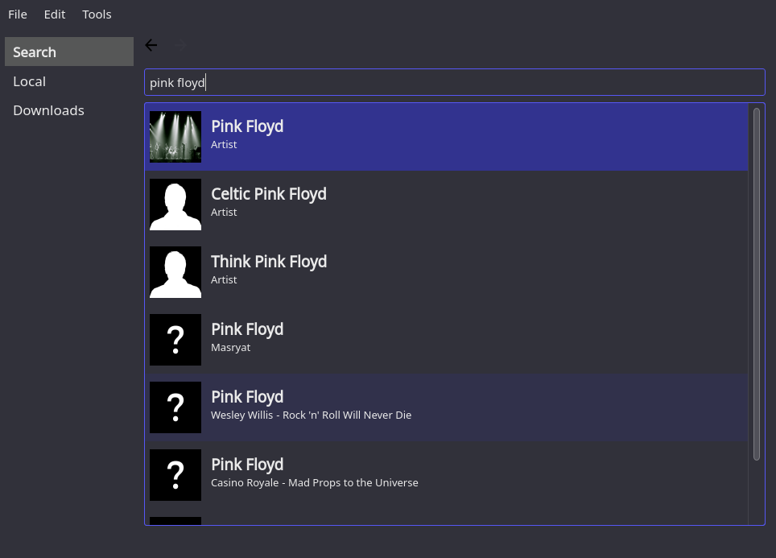
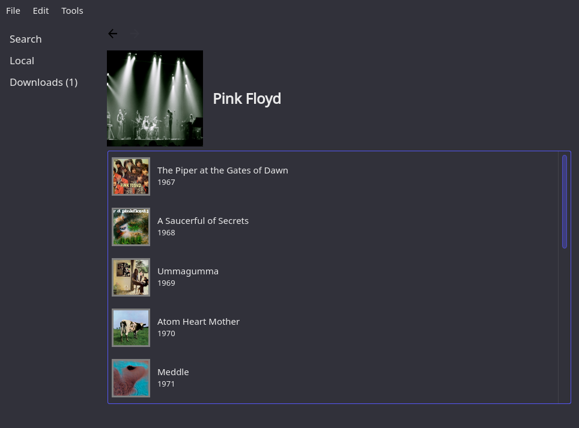
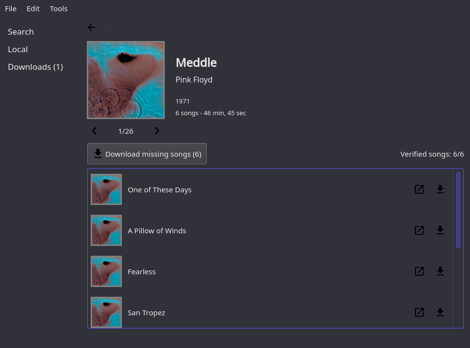
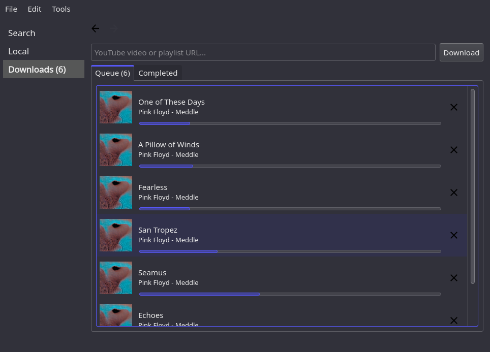

# Music Dragon

Desktop application written in Python3 + PyQt5 with a spotify-likish interface that can be used to 
search artists, albums and songs and automatically download and tag those with one click.

### Features
- Search artists, albums or songs (`musicbrainz`)
- Automatically download single songs or entire albums from youtube with a single click (`youtube_dl`)
- Manually download any song or playlist from youtube by pasting its URL
- Automatically fetch images of songs and albums
- Automatically tag downloaded songs using musicbrainz and youtube metadata, with a configurable tagging pattern
- Show and manage local songs
- Automatically recognize whether songs and albums have already been downloaded
  (the border of the song/album's cover changes accordingly)

### What it looks like

<div>
    
</div>
<div>
    
</div>
<div>
    
</div>
<div>
    
</div>

## INSTALLATION
```
pip install music-dragon
```

## USAGE
```
music-dragon
```

## TODO
* Improve UI
* Allow manual tagging of local songs (`eyed3`)
* Refactor